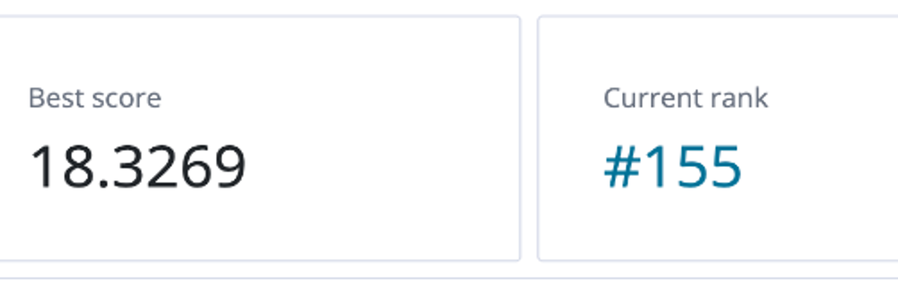

# Dengue Fever Case Prediction

## Overview
This project was developed as a group coursework assignment for the **Data Science with Machine Learning (COMP4030)** module. The goal is to predict the number of dengue fever cases in San Juan, Puerto Rico and Iquitos, Peru based on their environmental data.

## Data  
The dataset was downloaded from [DrivenData](https://www.drivendata.org/competitions/44/dengai-predicting-disease-spread/data/). It includes weekly dengue case counts from two cities, alongside weather variables such as temperature, humidity, precipitation, and vegetation indices.

## Key Steps  

- Data preprocessing was performed, including missing value imputation, feature integration, and unit standardization. To maintain the continuity of the time series, no rows were removed,

- Considering factors such as mosquito and virus incubation periods, dengue transmission is likely influenced by environmental conditions from previous weeks. Therefore, lag features of 5 and 10 weeks were generated to capture the impact of historical trends and seasonality on the current value of the target variable.

- Numerical features were selected using Recursive Feature Elimination (RFE) with Random Forest as the estimator. Random Forest model was trained on filtered data with sample weights to address target imbalance. 

- A custom dual-linear regression model was designed to improve prediction accuracy by combining seasonal trend modeling with residual prediction based on environmental lag features. The model first captures seasonal patterns in dengue cases using linear regression on time features, then fits the residuals with environmental features to refine the overall forecast.

## Results  
The final model achieved high accuracy with a Mean Absolute Error (MAE) of 18.33 and ranked 155th in DrivenData DengAI competition.



## Tech Stack

- **Language**: Python 3.9  
- **Environment**: Jupyter Notebook  
- **Data Processing**: Pandas, NumPy  
- **Visualisation**: Matplotlib, Seaborn  
- **Machine Learning**: Scikit-learn
- **Version Control**: Git, GitHub  

## Usage  
### Prerequisites
- Python 3.9 or higher
- Jupyter Notebook installed on your machine
### Setup
1. Clone the repository:
    ```
    git clone https://github.com/dawei-hu/dengue-fever-case-prediction.git
    cd dengue-fever-case-prediction
    ```
2. Install dependencies:
    ```
    pip install -r requirements.txt
    ```
3. Launch Jupyter Notebook:
    ```
    jupyter notebook
    ```
4. Open and run the notebook:  
Open the file `CW2_submission.ipynb` and run all the cells.
